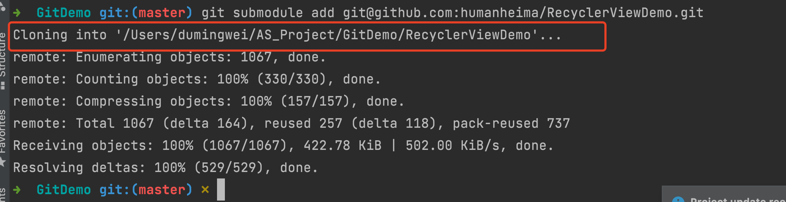

子模块允许你将一个 Git 仓库作为另一个 Git 仓库的子目录。 它能让你将另一个仓库克隆到自己的项目中，同时还保持提交的独立。


git@github.com:humanheima/RecyclerViewDemo.git

### 开始使用子模块
将一个已存在的 Git 仓库添加为正在工作的仓库的子模块。 你可以通过在 git submodule add 命令后面加上想要跟踪的项目的相对或绝对 URL 来添加新的子模块。
默认情况下，子模块会将子项目放到一个与仓库同名的目录中。


```shell
git submodule add git@github.com:humanheima/RecyclerViewDemo.git
```




### 克隆含有子模块的项目

克隆完项目以后，运行

```shell
git submodule init 
git submodule update
```

* git submodule init 用来初始化本地配置文件。
* git submodule update 则从该项目中抓取所有数据并检出父项目中列出的合适的提交。

或者直接使用一个合并的命令。 `git submodule update --init --recursive`。

在为父级项目拉取更新时，还会出现一种特殊的情况：在你拉取的提交中， 可能 .gitmodules 文件中记录的子模块的 URL 发生了改变。 比如，若子模块项目改变了它的托管平台，就会发生这种情况。 此时，若父级项目引用的子模块提交不在仓库中本地配置的子模块远端上，那么执行 git pull --recurse-submodules 或 git submodule update 就会失败。 为了补救，需要借助 git submodule sync 命令：

```shell
# 将新的 URL 复制到本地配置中
$ git submodule sync --recursive
# 从新 URL 更新子模块
$ git submodule update --init --recursive
```

初始化完子项目以后，需要进入每个子项目检出一个分支。用来跟踪远端的变化。比如我们检出远端的dev分支。

```shell
# 检出远程分支dev到本地 
git checkout -b dev origin/dev 
```

### 在包含子模块的项目上工作

在主项目切换分支的时候，使用命令

```shell
git checkout --recurse-submodules
``` 
它能为了我们要切换到的分支让子模块处于的正确状态。

* 拉取 
从子模块的远端拉取上游修改： 最不容易出错的方法，最简单的方法，直接进入子模块目录，切换不同的分支，拉取修改即可。

使用下面的命令也可以
```shell
git submodule update --init --recursive
```


* 推送

最不容易出错的方法，最简单的方法，直接进入子模块目录，切换不同的分支，将修改推送到远端，然后再推送主项目。

或者可以使用下面的命令，如果子项目没有推送的话，git会给你建议，按照建议来执行。

```shell
git push --recurse-submodules=check
```

或者使用下面的命令，在推送主项目的时候，先把子项目推送上去。

```shell
git push --recurse-submodules=on-demand
```


参考链接：


* [7.11 Git 工具 - 子模块](https://git-scm.com/book/zh/v2/Git-%E5%B7%A5%E5%85%B7-%E5%AD%90%E6%A8%A1%E5%9D%97)