参考链接：
[](https://github.com/geeeeeeeeek/git-recipes)
[](https://git-scm.com/book/zh/v2/%E8%B5%B7%E6%AD%A5-%E5%88%9D%E6%AC%A1%E8%BF%90%E8%A1%8C-Git-%E5%89%8D%E7%9A%84%E9%85%8D%E7%BD%AE)

当安装完 Git 应该做的第一件事就是设置你的用户名称与邮件地址
```xml
$ git config --global user.name "John Doe"
$ git config --global user.email johndoe@example.com
```
##git常用命令
* git log --pretty=oneline 显示简短的提交信息
* git config core.autocrlf true .这个命令解决（[master warning: LF will be replaced by CRLF）
* gitk 打开图形化界面 gitk --all 显示所有分支的图谱
* git reset HEAD file 取消暂存的文件  把暂存区的修改撤销掉（unstage），重新放回工作区 
* git reset --hard HEAD^ 从当前版本回退到上一个版本
* git reset --hard HEAD^^ 从当前版本回退到上2个版本
* git reset --hard HEAD~100 从当前版本回退到上100个版本
* git reflog 查看操作的历史
* git reset --hard 3628164 回退到某个特定commit id
* git diff filename 查看工作区中的文件和暂存区（或者版本库）中文件的区别。
* git diff --staged filename 查看暂存区中的文件和版本库中文件的区别。
9. git checkout -- file 丢弃工作区文件的修改。这里有两种情况：一种是file修改后还没有被放到暂存区，现在，撤销修改就回到和版本库一模一样的状态；
一种是file已经添加到暂存区后，又作了修改，现在，撤销修改就回到添加到暂存区后的状态。总之，就是让这个文件回到最近一次git commit或git add时的状态。
* git status --short 输出简单的状态信息
* git remote show origin 显示远程仓库更多的信息

**关于撤销修改**

场景1：当你改乱了工作区某个文件的内容，想直接丢弃工作区的修改时，用命令git checkout -- file。

场景2：当你不但改乱了工作区某个文件的内容，还添加到了暂存区时，想丢弃修改，分两步，
第一步用命令git reset HEAD file，就回到了场景1，第二步按场景1操作。

场景3：已经提交了不合适的修改到版本库时，想要撤销本次提交，git reset --hard HEAD^，不过前提是没有推送到远程库。

11. ssh-keygen -t rsa -C "youremail@example.com" 生成 SHH key
12.  git branch 查看分支
13.  git branch branchname 新建分支
14.  git checkout branchname 切换分支
15.  git checkout -b branchname 新建并切换分支。
16.  合并某分支到当前分支：git merge <name>
17.  删除分支：git branch -d <name>
18.  git log --graph 查看分支合并图
19.  git merge --no-ff -m "merge with no-ff" dev 禁用Fast forward
20.  git stash 把当前未提交的修改贮藏起来，是否添加进了 暂存区都可以。
21.  git stash list 查贮藏的的现场
*.  git stash apply 恢复贮藏的内容，但是贮藏的内容并不会删除，可以使用 git stash drop 来删除。
    使用git stash apply 恢复贮藏的内容 ，本来暂存的文件，也会被重新放回工作目录，如果想把stash前暂存的文件在应用暂存后重新放进暂存区的话可以使用git stash apply --index
*.  git stash pop 恢复贮藏的内容，恢复的同时把stash内容也删了。
24.  关于20条，21条，22条，23条的说明： 你可以多次stash，恢复的时候，先用git stash list查看，然后恢复指定的stash，git stash apply stash@{0} ， git stash drop stash@{0}，git stash pop stash@{0}。
25.  git branch -D <name> 强行删除一个没有被合并过的分支
26.  git remote 查看远程库的信息
27.  git remote -v显示更详细的信息 
28.  git pull -rebase 使用变基的形式拉取代码

    `git remote -v`

    `origin  git@github.com:michaelliao/learngit.git (fetch)`
    `origin  git@github.com:michaelliao/learngit.git (push)`

上面显示了可以抓取和推送的origin的地址。如果没有推送权限，就看不到push的地址。

1. git checkout -b dev origin/dev 检出远程分支dev到本地 
2. git log 显示从最近到最远的提交日志。 git log --prettry=oneline 输出一行信息
3. git checkout -b dev origin/dev 检出远程分支dev到本地 
5. 命令git tag <name>用于新建一个标签，默认为HEAD，也可以指定一个commit id；
6. git tag -a <tagname> -m "提交信息..."可以指定标签信息；
7. git tag可以查看所有标签。
8. git tag -d <标签名> 删除标签。
9. git push origin <tagname> 推送某个标签到远程。
10. git push origin --tags 一次性推送全部尚未推送到远程的本地标签
11. git tag -d <标签名> 删除本地标签
12. 删除远程标签 步骤1：git tag -d <标签名> 线删除本地标签，步骤2：git push origin :refs/tags/<tagname>删除远程标签。

## How to make Git “forget” about a file that was tracked but is now in .gitignore?
1. git rm -r --cached .
2. git add .
3. git commit -m "Remove ignored files"

## git rebase
1. 使用 git rebase 从远端拉取
2. 如果出现了冲突，首先手动解决冲突文件，然后使用 git add/rm <conflicted_files> 来添加或者移除冲突文件
3. 使用 git rebase --continue 继续变基，如果你想放弃这次变基的话，使用git rebase --abort

## git push
如果我想把本地的another分支推送到远程其他名字的分支，可以使用
git push origin HEAD:<其他分支的名字> 例如 git push origin HEAD:master

1.我把我的本地分支dmw推送到了远端的dmw,但是发现改错了，需要回退到上一个版本
```xml
git reset --hard HEAD^  //本地回退到上一个版本
git push --force //强制推送到远端，覆盖远端的版本即可
```

## 删除文件
如果确实需要删除文件
那就用命令git rm删掉，并且git commit
```git rm test.txt
git commit -m "remove test.txt"
```
另一种情况是删错了，因为版本库里还有呢，所以可以很轻松地把误删的文件恢复到最新版本,
git checkout其实是用版本库里的版本替换工作区的版本，无论工作区是修改还是删除，都可以“一键还原”。
```
git checkout -- test.txt
```
##交互式rebase
`git rebase - i `
rebase过程中用到的命令提示
```text
 Commands:
# p, pick <commit> = use commit
# r, reword <commit> = use commit, but edit the commit message
# e, edit <commit> = use commit, but stop for amending
# s, squash <commit> = use commit, but meld into previous commit
# f, fixup <commit> = like "squash", but discard this commit's log message
# x, exec <command> = run command (the rest of the line) using shell
# d, drop <commit> = remove commit
# l, label <label> = label current HEAD with a name
# t, reset <label> = reset HEAD to a label
# m, merge [-C <commit> | -c <commit>] <label> [# <oneline>]
# .       create a merge commit using the original merge commit's
# .       message (or the oneline, if no original merge commit was
# .       specified). Use -c <commit> to reword the commit message.
#
# These lines can be re-ordered; they are executed from top to bottom.

```

## rebase
场景 存在master分支，然后从master分支检出dmw分支，然后两者并行工作，master分支上提交了两次，dmw分支上也提交了两次，现在图谱如下
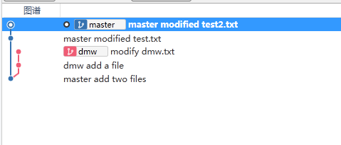

最终我们的目的是把所有的修改都合并到master分支上，步骤如下
1. git checkout dmw 首先切换到dmw分支
2. git rebase master 把dwm分支变基到master分支上
现在图谱如下
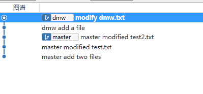
3. 切换到master分支，然后合并dmw分支即可
```xml
git checkout master
git merge dmw
```
合并后的图谱
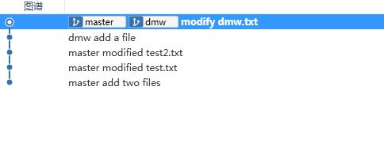

## 交互式rebase
1. 修改提交记录
图谱如下
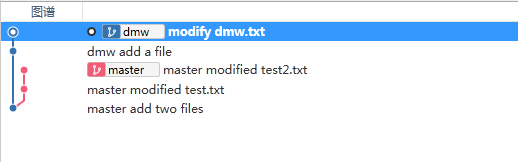
我现在在dmw分支上，我想修改`dmw add a file'这次提交记录，操作步骤
* 首先回到这次提交的上一次提交，就是`master add two files`这次提交,这次提交的commit id是 e8d22e1 
```
git rebase -i e8d22e1

```
弹出下面的对话框
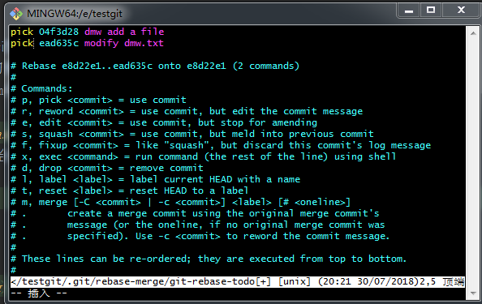
* 然后把`dmw add a file'这次提交的前面的pick改为edit，如下图所示
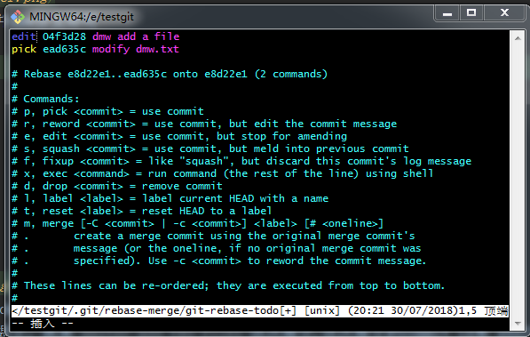
然后保存退出
* 使用如下命令修改提交信息
```text
git commit --amend
```
* 修改完提交信息以后，使用 如下命令继续rebase
```text
git rebase --continue
```
成功以后查看图谱如下
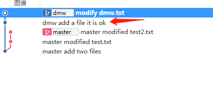

2. 删除某次提交并调整提交的顺序
现在dmw分支上多做几次提交，图谱如下
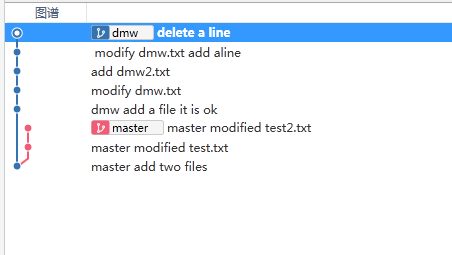
我想要做的操作 把 `f634c6a`这个提交删除，交换`144f5e4`和`34afe94`这两次提交交换顺序
```text
* 144f5e4 (HEAD -> dmw) delete a line
* 34afe94  modify dmw.txt add aline
* f634c6a add dmw2.txt  
* 8377d1a modify dmw.txt
* 0d0689c dmw add a file it is ok
* e8d22e1 master add two files

```
* 首先回到 `8377d1a modify dmw.txt`这次提交
```text
git rebase -i 8377d1a
```
图谱如下
[rebase change commit order and remove one commit](rebase_change_commit_order_and_remove_one_commit.png)

在上面弹出的编辑框中修改如下,然后保存退出即可
```text
drop f634c6a add dmw2.txt  
pick 144f5e4  delete a line
pick 34afe94  modify dmw.txt add aline
 
```
修改完成后，查看图谱,成功
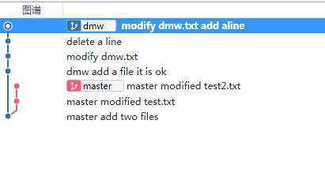

3. 合并多次提交为一次提交
```text
* 928ae89 (HEAD -> dmw) modify test.txt today
* 50bb833 modify second time
* 1b9b1af modify dmw.txt today
* 68ab912  modify dmw.txt add aline
* a08b3ec delete a line
* 8377d1a modify dmw.txt
* 0d0689c dmw add a file it is ok
* e8d22e1 master add two files

```
现在想合并`928ae89`,`50bb833`,`1b9b1af`这三次提交为一次提交，步骤如下
* 首先回到` 68ab912  modify dmw.txt add aline`这次提交
```text
git rebase -i 68ab912
```
弹出的编辑框如下
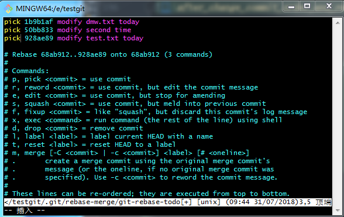
然后修改编辑信息如下
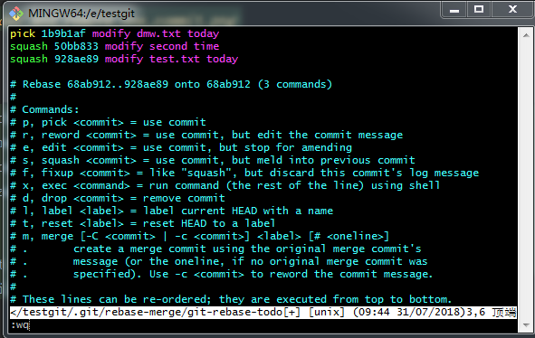
保存以后，会弹出一个编辑框，让你输入提交信息，输入提交信息，然后保存
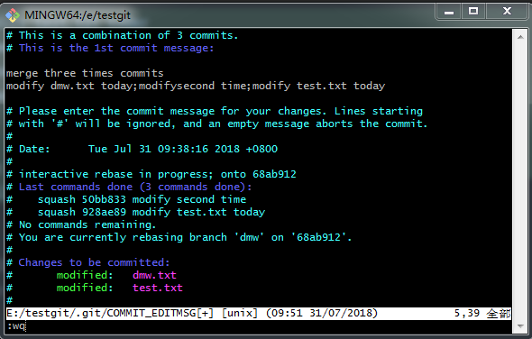
保存后，变基成功，查看提交历史
```text
$ git log --graph --oneline

```
结果如下，合并了三次提交为一次提交
```text
* f0588d4 (HEAD -> dmw) merge three times commits modify dmw.txt today;modifysecond time;modify test.txt today
* 68ab912  modify dmw.txt add aline
* a08b3ec delete a line
* 8377d1a modify dmw.txt
* 0d0689c dmw add a file it is ok
* e8d22e1 master add two files

```

4. 现在提交历史如下
```text
 d449efe (HEAD -> dmw) modify test.txt
* 808d9cf add second line haha
* 6d1d443 add a line in today.txt
* ec53171 add dmw2.txt
* 200d218 merge three times commits modify dmw.txt today;modifysecond time;modify test.txt today
* 065a6e0 create today.txt
* dfbc4b4 modify dwm.txt on 2018/07/31
* a08b3ec delete a line
* 8377d1a modify dmw.txt
* 0d0689c dmw add a file it is ok
* e8d22e1 master add two files

```
现在想要把`6d1d443 add a line in today.txt`这个提交拆分成两次提交信息

* 首先回到这次提交的上次提交`ec53171 add dmw2.txt`
```text
git rebase -i ec53171
```
弹出的编辑框如下
```text
pick 6d1d443 add a line in today.txt
pick 808d9cf add second line haha
pick d449efe modify test.txt

```
然后修改编辑内容如下，并保存
```text
edit 6d1d443 add a line in today.txt
pick 808d9cf add second line haha
pick d449efe modify test.txt

```
当前提交历史如下
```text
 6d1d443 (HEAD) add a line in today.txt
* ec53171 add dmw2.txt
* 200d218 merge three times commits modify dmw.txt today;modifysecond time;modify test.txt today
* 065a6e0 create today.txt
* dfbc4b4 modify dwm.txt on 2018/07/31
* a08b3ec delete a line
* 8377d1a modify dmw.txt
* 0d0689c dmw add a file it is ok
* e8d22e1 master add two files


```
然后reset到上一个提交,注意 不能加 --hard选项
```text
git reset HEAD^

```
然后修改 today.txt 然后提交一次  ` first split`
然后再次修改today.txt然后提交一次  `"second split`
然后运行
```text
git rebase --continue
```
如果过程中有冲突的话，解决冲突，然后使用 `git add .`,添加解决后的冲突文件，然后再次运行
```text
git rebase --continue
```
然后会弹出编辑框提示你输入新的提交信息
最后的提交信息
```text
05f7101 (HEAD -> dmw) modify test.txt
* c0a421b add second line haha
* 28c919c second split
* 9793e02 first split
* ec53171 add dmw2.txt
* 200d218 merge three times commits modify dmw.txt today;modifysecond time;modify test.txt today
* 065a6e0 create today.txt
* dfbc4b4 modify dwm.txt on 2018/07/31
* a08b3ec delete a line
* 8377d1a modify dmw.txt
* 0d0689c dmw add a file it is ok
* e8d22e1 master add two files

```
* 使用命令行删除远程分支
```xml
git push origin --delete feature-20180720-input-blacklist-reason
```
### Git只合并某次commit
### Git只合并某次commit

参考链接 [git只合并某次commit](https://www.jianshu.com/p/24e651a6a2ac)

如图所示

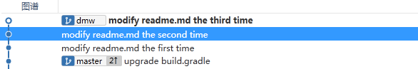

现在 dmw分支上比master分支上多个3个提交
必须我现在只想要 modify readme.md second time 这次提交

1. 先找到这次提交的哈希值 d42ccdf
2. 切换到 master分支
3. 运行 git cherry-pick d42ccdf
4. 遇到冲突，解决后 运行 git add 冲突的文件
5. 运行 git cherry-pick --continue 即可。这时候会弹出编辑框，让你编辑提交信息，编辑完毕保存即可。


现在我想合并 dmw 分支上的 两次提交 到 maste分支上

### 合并某个分支上的一系列commits

如图所示


modify readme.md the second time  [e5a9ca5]
modify readme.md the first time   [1ef07c2]

方法1 ：

1. 运行 git checkout -b dmw-temp 基于dmw分支的modify readme.md the second time 这个提交新建一个临时分支 dmw-temp 并切换到 dmw-temp分支
2. 然后运行 git rebase --onto master 1ef07c2^  把 dmw-temp 分支上 从e5a9ca5 到 1ef07c2 的提交都rebase到 master分支上 。
1ef07c2^ 表示从哪个提交开始
3. 切换到 master 分支 ，运行 git merge dmw-temp 即可。

方法2：
1. 运行 git checkout -b dmw-temp 基于dmw分支的modify readme.md the second time 这个提交新建一个临时分支 dmw-temp 并切换到 dmw-temp分支
2. 然后使用交互式变基 git rebase -i master ，然后选取想要的提交。
3. 切换到 maser 分支 git merge dmw-temp 即可。然后删除历史分支。

