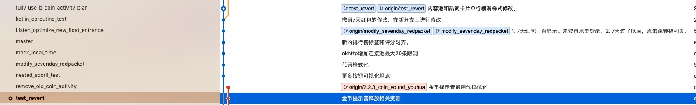
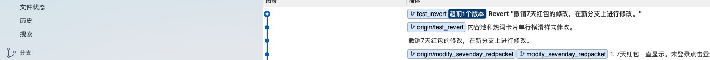

场景是这样的：

1. 我在`developer`分支我做了一个修改提交，并且提交到了远端分支。提交完以后才想起来这个功能可能不需要，所以我就从该节点检出了一个分支`modify_sevenday_redpacket`。
2. 然后在`developer`分支上，我手动把这些修改撤销掉了。然后在把修改推送到了远端分支。提交是 `25cf124465ea9c71bb3ca88f692b63768395fc11 [25cf124465]`
3. 后来这个功能是需要合并到`developer`分支的，然后我想在`developer`分支上把`modify_sevenday_redpacket`分支合并过来，发现代码合并不过来。。。

由于着急发版本，然后改动的文件就4个，我就在在`developer`分支上对比`modify_sevenday_redpacket`分支上这4个文件的差异，然后应用`modify_sevenday_redpacket`分支上
的修改来解决的。

然后遇到这种情况正确的解决方法是什么呢？我们现在来测试一下。

新建一个`test_revert`分支。



其实很简单，
我们只要运行一下 git revert命令，后面加上对应的提交节点就可以。在这个例子中，我们的提交节点是`25cf124465`。

```
git revert 25cf124465
```

revert 成功以后，提交一下就可以。如下图所示




